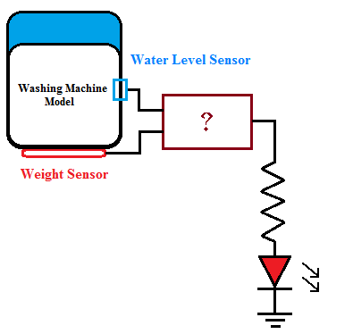

Q1. Which of the following gates would you choose if the alarm is to be activated if temperature and pressure exceed their maximum limits at the same time?   
**A  AND**  
B  OR  
C  NOR  
D  NAND  

Q2. Under what condition would a two input OR gate allow a logic signal to pass through to its output unchanged?  
A  When one of the inputs is HIGH.  
B  When both the inputs are HIGH  
C  When both the inputs are LOW.  
**D  When one of the inputs is LOW**

Q3. Are the two statements below concerning an OR gate always true? (i) If the output waveform from an OR gate is the same as the waveform at one of its inputs, the other input is being held permanently LOW. (ii) If the output waveform from an OR gate is always HIGH, one of its inputs is being held permanently HIGH.  
**A  Yes**  
B  No  
C  Not predictable  
D  None of these  

Q4. When the weight is overloaded (logic 1 o/p of weight sensor) or the water level is low (logic 1 o/p of level sensor) or both conditions are true, which gate should be used to indicate alarming condition?  

  
A  AND  
**B  OR**  
C  NOT  
D  XOR  

Q5. Complete each expression:   
(i) A + 1 = __________   
(ii) A + 0 = __________   
(iii) A + A’ = _______   
(iv) A+ A = _________   
A  A,1,A,1   
**B  1,A,1,A**  
C  A,0,A,A  
D  1,A,0,A  

