Q1. For the gate shown, inputs A & B are applied which produce an output as shown in Option:  

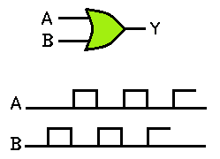  
**A    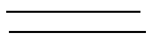**  
B    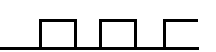  
C    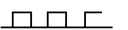  
D    None of the above  

Q.2 Which of the following logic circuit represents the situation: The output Y will go HIGH whenever conditions A & B exist simultaneously or whenever conditions C & D exist simultaneously.  
A    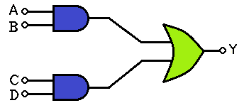  
B    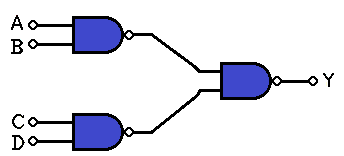  
**C    Both A and B.**  
D    None of the above.

Q3. The output goes LOW only when all inputs are LOW is the interpretation of which of the following gate symbols?  
**A    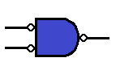**  
B    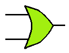  
C    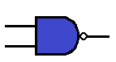  
D    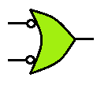  

Q4. An OR gate with inverted inputs is a ___________gate.   
A  AND  
**B  NAND**  
C  NOR  
D  NOT  

Q 5. The Boolean expression for the switch analogy shown below is:  
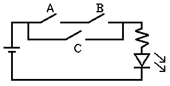  
A  (A + C).B  
B  (A + C).B  
**C  A.B + C**  
D  None of these  
 