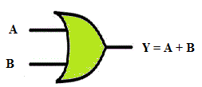
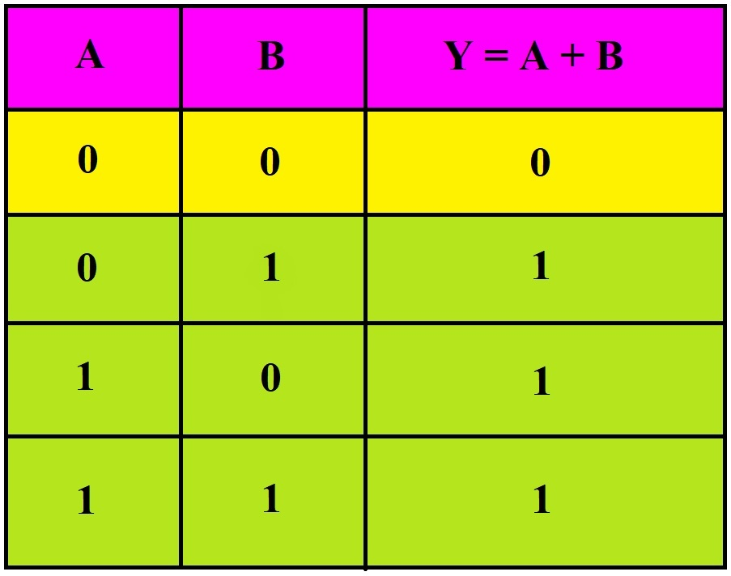
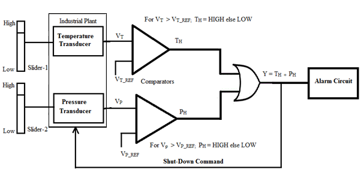

### 
  INDUSTRIAL CONTROL SYSTEM APPLICATION  

### 1 INTRODUCTION

AND, OR and NOT gates are basic logic gates and are fundamental building blocks from which all other logic circuits and digital systems can be constructed. Basic logic gates such as AND and OR can be used to control the passage of an input signal through to the output. This controlling action is why these circuits are referred to as *gates*.

### 1.1    OR GATE

|Description | Produces a HIGH output if either one or all the inputs are HIGH. |
|-------|--------------------|
|Symbol|  | 
|Truth Table|  |

### 1.2    APPLICATION: INDUSTRIAL CONTROL SYSTEM

All applications in real world where the occurrence of *any one or more than one* event is needed to be detected, OR gates can be used. For instance, In a chemical process or an industrial plant, if one or more parameters exceeds the safe limit, it is desirable that an alarm should be activated along with protective measure such as turning off the valve or shutting down the plant/process. This is possible by using the OR operation along with some additional circuitry.

 Let us consider the example of an industrial control system. In an industrial process, it may be desired that when the temperature and pressure exceeds the safe limits, an alarm needs to be activated and the process needs to be stopped.

   
 
Fig.1. Use of OR gate in Industrial Control System

 ### 1.3 CONCEPT

To detect whether the process temperature or pressure exceeds the safe limits and indicate the same via alarm and generate a process shutdown signal for the system.

The temperature and pressure transducers produce output voltages VT and VP proportional to the process temperature and pressure respectively. These voltages are compared with pre-set values of temperature reference VT_REF and pressure reference VP_REF in a voltage comparator circuit. Let TH and PH represent the comparator outputs.

Whenever VT > VT_REF or VP > VP_REF then the upper and the lower comparators produce a HIGH output respectively at points TH and PH respectively. When either of the parameters exceeds the safe limit, the alarm is activated and the process shut down command is generated.
